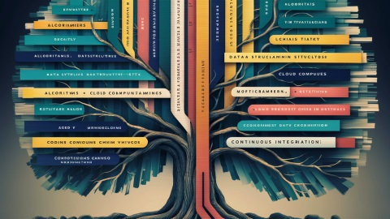

<h1>Hi there, I am <a href="https://rolandougalde.github.io/">Rolando</a> 👋</h1>

  

About me:

- :whale: I’m an IT infrastructure professional & Coder
- :office: ..currently working at [International-Teleccom](https://international-telecom.com/)
- :snake: ..currently learning Python programming
- :books: ..writing Dev projects documentation
- :penguin: ..looking for all kind of Open Source projects.
- :black_nib: ..want to create a MarkDown based, APA compliant.

## Highlighted Projects & Docs

<table>
<tr>
<td width="50%">
<h3 align="center">Slate Docs</h3>

<!-- <a href="https://" target="_blank">
 -->
</a>

A knowledge base on a JAMstack Slate site generator is a static, fast, and scalable documentation platform. It supports markdown content, customizable themes, and integrates with modern CI/CD pipelines for seamless updates.

                                                                                      
</td>

<td width="50%">
               <!--   -->
<h3 align="center">Shell Jobs</h3>

                                       

 

<!--<a href="https://" target="_blank">
 -->
</a>

Scripts for common tasks like backups, file synchronization, and server configurations automate routine operations. They enhance efficiency by scheduling tasks, reducing manual effort, ensuring consistency, and improving system reliability. These scripts often use shell.

                                                             
</table>                                                                                 

 

<table>
<tr>
<td width="50%">
<h3 align="center">JamStack Architecture</h3>

<!-- <a href="https://" target="_blank">
  -->
</a>

JAMstack offers goodies like improved performance, enhanced security, and simplified scaling, APIs, and modern JavaScript frameworks. Learning JAMstack empowers developers to build fast, leveraging the latest web technologies and best practices.

                                                                                      
</td>       

<td width="50%">
<h3 align="center">Mermaid Charts</h3>

<!-- <a href="https://" target="_blank">
 -->
</a>

Mermaid diagrams simplify visualizing complex data by generating flowcharts, Gantt charts, and more using easy-to-write text-based syntax. Ideal for documentation, it integrates seamlessly with markdown and various tools, making it a versatile choice for developers and technical writers.

                                                                                      
</td>  
</table>              

### ⚙️ &nbsp;GitHub Analytics

